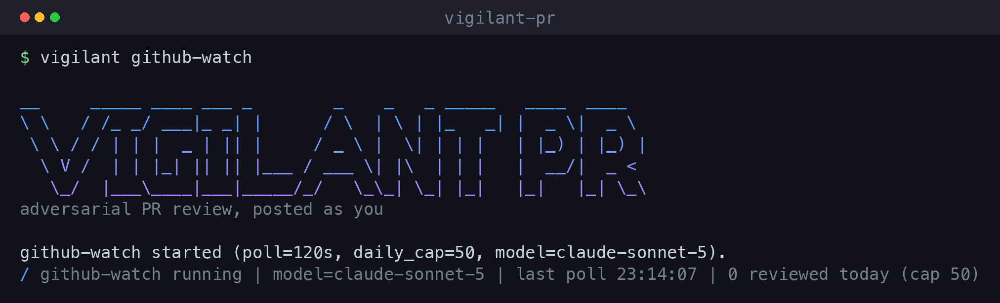
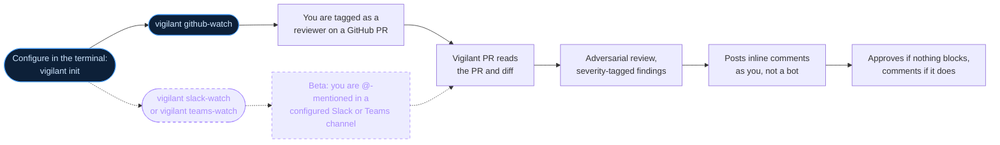

<p align="center">
  <picture>
    <source media="(prefers-color-scheme: dark)" srcset="assets/vigilant-pr-logo-dark.svg" />
    
  </picture>
</p>

<p align="center"><em>A portable, workflow-agnostic AI pull-request reviewer that posts review comments <b>on behalf of you</b> - your GitHub identity, not a generic bot.</em></p>

---

Get tagged as a reviewer on a pull request, and Vigilant PR reviews it and posts
the comments as **you** - your GitHub identity, not a bot. No repo-side setup, no
GitHub App, just your token.

<p align="center">
  
</p>



## Status

**v1 - ready to use** for reviewing GitHub pull requests.

**Use any AI model you want.** Give Vigilant PR an API key for your preferred
provider and it uses that model - Claude, GPT, Gemini, Grok (xAI), Llama,
NVIDIA, OpenRouter, or a model you run locally. Some are free, some paid - your choice.
You just set your key and pick a model (or run `vigilant init`, which does it
for you). See [Models](#models) for the exact options.

Slack and Teams support also exists, but is still beta.

## Requirements

- Python 3.12+
- The GitHub CLI `gh`, authenticated as the user who should author the comments
  (`gh auth login`), or a `GH_TOKEN` env var with Pull requests: read/write.
- An API key for **any supported model provider** - including free, no-card
  tiers (Groq, Google Gemini, NVIDIA NIM). See [Models](#models).

The core engine is dependency-free (standard library only) - model calls go over
plain HTTP, no SDKs.

## Setup

Run `vigilant init` once. It connects your GitHub account (runs `gh auth login`
for you if needed) and stores a model key - there are no files to edit. Keys are
kept in a `0600` file at `~/.config/vigilant-pr/credentials.json` (the same
posture as the `gh` and `aws` CLIs).

Manage and switch models with the `model` command:

```bash
vigilant model add            # pick a provider, paste a key (stored, becomes active)
vigilant model add groq       # or name the provider directly
vigilant model list           # see stored providers, masked keys, and the active one
vigilant model use groq       # switch the active model (by provider or provider/model)
vigilant model remove openai  # delete a stored key
```

Prefer files/CI? A `.env` file and real environment variables still work and
always take precedence over the stored keys (real env > `.env` > store). Copy
`.env.example` to `.env` and fill in what you use. If you set no model, Vigilant
auto-selects one from whichever provider key it finds (Anthropic preferred) and
prints which model it chose.

## Install

```bash
pipx install git+https://github.com/tllongdev/vigilant-pr
# or pin a specific release:
pipx install git+https://github.com/tllongdev/vigilant-pr@v1.1.0
# or, from a clone:
uv tool install .
```

`main` is the stable release line, so the unpinned command always gets the
latest release.

## Upgrade

Check what you have, then upgrade in place - your stored config and API keys
live in `~/.config/vigilant-pr/` and are never touched by an upgrade:

```bash
vigilant --version

# pipx: force a reinstall from the latest main (most reliable)
pipx install --force git+https://github.com/tllongdev/vigilant-pr
# uv:
uv tool install --force git+https://github.com/tllongdev/vigilant-pr
# container:
docker pull ghcr.io/tllongdev/vigilant-pr:latest
```

Use `--force`. `pipx upgrade` / `uv tool upgrade` compare version strings, so a
plain upgrade can report "already up to date" and skip a newer `main` commit
that didn't bump the version - and a pinned `@vX.Y.Z` install won't move at all.
A forced reinstall always pulls the current code. To pin instead, reinstall with
an explicit tag: `pipx install --force git+https://github.com/tllongdev/vigilant-pr@v1.6.0`.

## Fastest start (GitHub)

From zero to auto-reviewing PRs as you, in three commands:

```bash
pipx install git+https://github.com/tllongdev/vigilant-pr
vigilant init      # connects GitHub, picks + stores a model key (free options first)
vigilant github-watch   # auto-reviews any open PR where you're a requested reviewer
```

`vigilant init` walks you through everything: it connects your GitHub account
(running `gh auth login` for you if needed), lets you pick a model provider
(leading with free, no-credit-card options like Groq), validates the key, and
stores it. Nothing to hand-edit; switch models later with `vigilant model use`.

Want to see a review before it posts anything? Dry-run any PR first:

```bash
vigilant review https://github.com/owner/repo/pull/123 --dry-run
```

That's the whole flow: install, `init`, watch. Everything below is reference for
specific models, watcher tuning, and the chat surfaces.

---

<p align="center">
  <a href="https://square.link/u/A8qxaJVb"></a>
</p>

<p align="center">
  <a href="https://square.link/u/A8qxaJVb"></a>
</p>

<p align="center"><b>Vigilant PR is free to use right now.</b><br/>
If it adds value to your workflow, <a href="https://square.link/u/A8qxaJVb">donations</a> go directly toward its continued development and maintenance.<br/>
Apple Pay and Google Pay supported - one tap, no card number.</p>

---

## Usage

```bash
# Review a PR and post as you (Sonnet 5, the default tier)
vigilant review https://github.com/owner/repo/pull/123

# Escalate to Opus 4.8 for a hard PR
vigilant review 123 --repo owner/repo --opus

# Preview without posting
vigilant review 123 --repo owner/repo --dry-run

# Preview, then approve before it posts (great while trying a new model)
vigilant review 123 --repo owner/repo --approve
```

### Review before it posts (approval gate)

By default reviews post automatically. If you're trying an unfamiliar model - or
just want to watch what it produces before trusting it - turn on the approval
gate: Vigilant prints the full review (summary + inline comments) and asks for a
`y/N` before anything is posted.

- One-off: add `--approve` to `review` or `github-watch`.
- Always on: set `VIGILANT_REQUIRE_APPROVAL=1` (or answer "yes" in `vigilant init`).
- Turn it back off: `--no-approve` or `VIGILANT_REQUIRE_APPROVAL=0`.

Once you trust the model, drop the flag and let it post on your behalf.

## Models

Vigilant PR is model-agnostic. Pick a model with a `provider/model` string via
`--model` or the `VIGILANT_MODEL` env var, and supply that provider's key. A bare
name (e.g. `claude-sonnet-5`) is treated as Anthropic, so existing setups keep
working. Under the hood there are just two wire protocols - the Anthropic
Messages API and the OpenAI-compatible `/chat/completions` API - so most
providers, local servers, and gateways work out of the box.

| You have... | `VIGILANT_MODEL` | Also set |
|---|---|---|
| **Nothing - want a free real model** | `groq/llama-3.3-70b-versatile` | `GROQ_API_KEY` (free, no card) |
| A free Gemini key | `gemini/gemini-2.5-flash` | `GEMINI_API_KEY` (free tier) |
| A free NVIDIA key | `nvidia_nim/deepseek-ai/deepseek-v3.2-exp` | `NVIDIA_NIM_API_KEY` (free, no card) |
| A Claude / Anthropic key (best results) | `anthropic/claude-sonnet-5` (or `-opus-4-8`) | `ANTHROPIC_API_KEY` |
| An OpenAI key | `openai/gpt-5.5` | `OPENAI_API_KEY` |
| An OpenRouter key | `openrouter/meta-llama/llama-3.3-70b-instruct` | `OPENROUTER_API_KEY` |
| An xAI **Grok** key (not Groq) | `xai/grok-4.5` | `XAI_API_KEY` |
| A local model (Ollama) | `ollama/qwen2.5:14b` | `VIGILANT_API_BASE=http://localhost:11434/v1` if not default |
| Any OpenAI-compatible server (vLLM, LM Studio, TGI) | `openai_compatible/<model>` | `VIGILANT_API_BASE`, `VIGILANT_API_KEY` (if required) |
| An AI gateway / LLM proxy | `gateway/<model>` | `VIGILANT_API_BASE` + auth (see below) |
| Just want to see it run | `mock` | nothing (scripted output, no key, no cost) |

### AI gateway / LLM proxy

If your models are fronted by an OpenAI-compatible AI gateway or LLM proxy
(LiteLLM, Portkey, Cloudflare AI Gateway, Kong, a self-hosted proxy, or an
internal enterprise gateway - often for centrally-managed, lower-cost access),
point Vigilant at it with the `gateway` provider. It's fully vendor-neutral - no
gateway is named in code, you just supply the endpoint and credentials.

The easiest path is the guided wizard, which prompts for the base URL and auth
mode and saves everything to the managed credential store:

```bash
vigilant model add gateway
```

Or configure it manually with environment variables (or a `.env`). Set the model
and base URL, then pick one auth mode:

```bash
export VIGILANT_MODEL=gateway/your-model-name
export VIGILANT_API_BASE=https://gateway.example.com/v1

# Auth A: a static bearer token
export VIGILANT_API_KEY=...

# Auth B: OAuth2 client-credentials (token is fetched, cached, and auto-refreshed)
export VIGILANT_OAUTH_TOKEN_URL=https://auth.example.com/oauth/token
export VIGILANT_OAUTH_CLIENT_ID=...
export VIGILANT_OAUTH_CLIENT_SECRET=...
# optional:
export VIGILANT_OAUTH_SCOPE=...        # scope, if your IdP requires one
export VIGILANT_OAUTH_AUDIENCE=...     # audience, if your IdP requires one
export VIGILANT_OAUTH_AUTH_STYLE=basic # send client id/secret as HTTP Basic (default: body)
```

Free tiers get you started in ~2 minutes:

- **Groq** (fastest): https://console.groq.com/keys (key starts with `gsk_`)
- **Gemini**: https://aistudio.google.com/apikey
- **NVIDIA NIM**: https://build.nvidia.com (key starts with `nvapi-`)

```bash
export GROQ_API_KEY=gsk_...
export VIGILANT_MODEL=groq/llama-3.3-70b-versatile
vigilant review https://github.com/owner/repo/pull/123
```

Run `vigilant models` to see which providers your credentials can reach (and, where
the provider exposes a list endpoint, the exact model ids you can use).

> **For the deepest reviews, use a frontier model.** Adversarial bug-finding
> scales with model quality; Claude Sonnet 5 (default) or Opus 4.8 catch subtler
> issues than small free models. The free tiers are great for trying it out and
> for lighter PRs. Extended-thinking tuning (Opus adaptive thinking) applies only
> to the Anthropic path; other providers run with a low review temperature.

## Watcher (daemon mode)

`vigilant github-watch` polls GitHub for open PRs where **you** are a requested
reviewer and auto-reviews them on your behalf. It is idempotent (never re-reviews
the same head SHA), bounded (poll interval + per-day cap), and resilient (a
failure on one PR never crashes the loop). No GitHub App, no webhooks - just your
token. (The old name `vigilant watch` still works as an alias.)

```bash
# Run continuously (default: poll every 120s, cap 50 reviews/UTC-day)
vigilant github-watch

# One pass and exit - ideal for cron
vigilant github-watch --once

# Tune cadence and cap
vigilant github-watch --poll-interval 300 --daily-cap 20
```

### Scoping which repos it touches

By default the watcher reviews any PR you are requested on. Constrain it with
env vars (comma-separated). Deny always wins; a non-empty allow list is
exclusive:

```bash
export VIGILANT_ORG_ALLOW="acme,acme-labs"      # only these orgs
export VIGILANT_REPO_DENY="acme/secret-repo"    # never this repo
export VIGILANT_MODEL="claude-opus-4-8"          # default tier for the daemon
```

### Deploy as a container

The seen-cache lives at `~/.vigilant/seen.json` (override with
`VIGILANT_SEEN_PATH`). Mount a volume so idempotency survives restarts:

```bash
docker run -d --name vigilant-pr --restart unless-stopped \
  -e ANTHROPIC_API_KEY \
  -e GH_TOKEN \
  -e VIGILANT_ORG_ALLOW="acme" \
  -v vigilant-state:/root/.vigilant \
  -e VIGILANT_SEEN_PATH=/root/.vigilant/seen.json \
  ghcr.io/tllongdev/vigilant-pr:latest github-watch
```

### Token scopes

The watcher uses only your token. It needs:
- **Contents: read** and **Pull requests: read/write** on the target repos
  (post reviews, read diffs).
- Repo read access sufficient for `gh search prs --review-requested=@me` to see
  the PRs you are tagged on.

## Slack watch (beta, no app)

> **Beta.** The GitHub `review`/`github-watch` flow above is the stable core.
> `slack-watch` works with no Slack app, but it depends on your Slack session
> token, so validate it in your own workspace before relying on it.

`vigilant slack-watch` polls a Slack channel and reviews any PR you're
**@-mentioned** on - whether the mention is a top-level message or a reply
inside a thread. It needs **no Slack app and no workspace-admin approval** - it
authenticates with a token you already have and only reads a channel you can
already read. It's dependency-free (stdlib only).

There are two app-free ways to give it a token:

**Auto (recommended) - `--auto-token`.** Vigilant reads the token straight from
your logged-in Slack session in Chrome and **automatically re-extracts it when
Slack expires it**, so a long-running monitor never dies on an expired session.
This needs the optional refresh extra (one-time):

```bash
pipx install 'vigilant-pr[slack-refresh] @ git+https://github.com/tllongdev/vigilant-pr'
# or, into an existing install: pip install 'vigilant-pr[slack-refresh] @ git+https://github.com/tllongdev/vigilant-pr'
python -m playwright install chromium

export GH_TOKEN="ghp_..."
export VIGILANT_MODEL="groq/llama-3.3-70b-versatile"   # or any provider
vigilant slack-watch --auto-token --channel C0123ABCD
```

If you belong to multiple Slack workspaces, Vigilant picks the one that can read
your channel automatically; set `VIGILANT_SLACK_TEAM=T0123` to force one.

**Static - set the token yourself.** No refresh (an `xoxc-` token expires in a
few hours; an `xoxb-`/`xoxp-` OAuth token lasts):

```bash
export SLACK_TOKEN="xoxc-..."               # or xoxb-/xoxp-
export SLACK_COOKIE_D="xoxd-..."            # required only for xoxc- tokens
export GH_TOKEN="ghp_..."
export VIGILANT_MODEL="groq/llama-3.3-70b-versatile"
vigilant slack-watch --channel C0123ABCD    # repeatable, or VIGILANT_SLACK_CHANNELS=C1,C2
```

A message triggers a review only when it both @-mentions you **and** contains a
GitHub PR link, so it won't fire on every PR posted in a busy channel (and it
never loops on its own reply). By default it posts the outcome back in-thread;
pass `--no-reply` to stay silent. Your Slack user id is auto-detected from the
token via `auth.test`; override with `VIGILANT_SLACK_USER_ID`. Find a channel ID
from the channel's "View channel details" footer, or the `/archives/C…` URL.

It also **persists progress** to `~/.config/vigilant-pr/slack_watch/` (override
with `VIGILANT_SLACK_STATE_DIR`), so a restart resumes where it left off: it
reviews anything that arrived while it was down, and won't re-review or lose
track of threads. At startup it seeds tracked threads from the last week of
history, so it catches @-mentions in replies to recently-active threads, not
just brand-new ones. (Residual edge: a reply to a thread with no activity in the
last ~7 days won't be tracked.)

```bash
docker run -d --name vigilant-slack-watch --restart unless-stopped \
  -e GH_TOKEN -e GROQ_API_KEY -e VIGILANT_MODEL \
  -e SLACK_TOKEN -e SLACK_COOKIE_D -e VIGILANT_SLACK_CHANNELS \
  ghcr.io/tllongdev/vigilant-pr:latest slack-watch
```

## Teams watch (beta)

`vigilant teams-watch` serves a Microsoft Teams **Outgoing Webhook** endpoint.
Teams has no Socket-Mode equivalent, so this surface needs an inbound HTTPS URL
(put it behind your reverse proxy or a tunnel). It is dependency-free (stdlib
HMAC + HTTP). (The old name `vigilant teams` still works as an alias.)

Because a review outlasts Teams' ~5s response budget, the webhook acks
immediately and posts the result to a Teams **Incoming Webhook**
(`TEAMS_INCOMING_WEBHOOK_URL`) when the review finishes.

```bash
export TEAMS_HMAC_SECRET="<base64 secret Teams shows on webhook creation>"
export TEAMS_INCOMING_WEBHOOK_URL="https://outlook.office.com/webhook/..."  # optional
export ANTHROPIC_API_KEY="sk-ant-..." GH_TOKEN="ghp_..."
vigilant teams-watch --port 8080
```

Then @-mention the outgoing webhook with a PR link in a channel.

## Identity and honesty

Comments are authored by your GitHub token, so they are *your* review and read
as your own writing. By default each review summary ends with a short, quiet
footnote disclosing that it was AI-assisted, which model produced it, and who it
was posted on behalf of - honest attribution without a heavy bot banner:

> ---
> <sub>AI-assisted review via Vigilant PR · claude-sonnet-5 · posted by @you</sub>

Disable it with `--no-attribution` or `VIGILANT_ATTRIBUTION=0` for private/personal
use. Separately, each body carries a hidden HTML-comment marker (invisible on
GitHub) that lets the tool recognize its own prior comments for dedup and
re-review.

Approval is mechanical and honest: the review is submitted as **APPROVE** when
there are no blocking findings (no critical, no medium) - so nit-only or clean
PRs get approved with their comments attached - and as a **COMMENT** when
anything blocks (or a prior concern is re-flagged as unresolved). It never uses
`REQUEST_CHANGES`, so it surfaces problems without hard-blocking the PR. The
goal is to move PRs forward unless something genuinely blocks merge.

## Data flow & privacy

Vigilant PR runs entirely on your machine or CI. It has no server, no account,
and no telemetry - it never sends your data to us or to any third party you
didn't configure. Here is exactly what leaves your machine, and when:

| Data | Goes to | When | Notes |
|---|---|---|---|
| PR diff, changed-file context, and your repo's guidance files (`AGENTS.md`/`CLAUDE.md`) | The model provider you choose | Every review | A cloud model (Anthropic, OpenAI, Groq, Gemini, NVIDIA, OpenRouter, xAI) receives this over the internet under that provider's API data policy. A local model (Ollama) or your own self-hosted/gateway endpoint keeps it on your machine/network. |
| PR metadata and your review comments | GitHub, via the `gh` CLI | Every review | GitHub already hosts your code; the review is posted as you. |
| Channel messages / @-mentions | Slack or Teams | Only if you run `slack-watch` / `teams-watch` | Uses a token you already have. |
| API keys and tokens | Stored locally in a `0600` file | Setup | Transmitted only as auth headers to the services above - never anywhere else. |

**Maximum privacy:** pick a local model (`ollama/...`) or your own
OpenAI-compatible gateway. Then your code is never sent to a third party -
inference runs on your own hardware and the only external call is to GitHub,
which already has your code.

## License & trademarks

Vigilant PR is licensed under the Apache License 2.0 - see [LICENSE](LICENSE)
and [NOTICE](NOTICE). Copyright (c) 2026 Timothy Long / Longitudinal Intelligence Technologies (LIT).

"Vigilant PR" and the Vigilant PR logo are trademarks of Longitudinal Intelligence Technologies (LIT). The license
covers the source code; it does not grant rights to the name or logo. You're
welcome to build on the code under Apache-2.0, but forks and derivatives must
use their own name and branding.

Contributions are accepted under the terms in [CONTRIBUTING.md](CONTRIBUTING.md).
